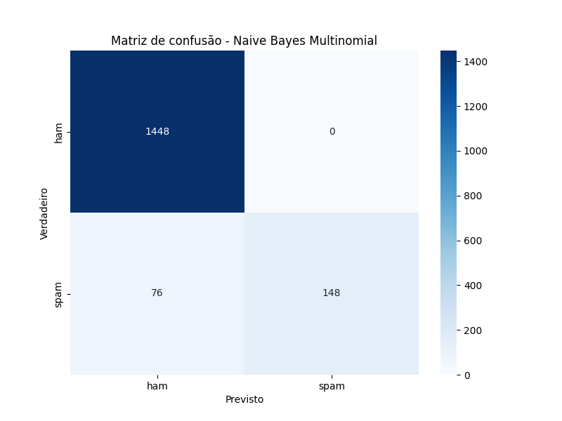
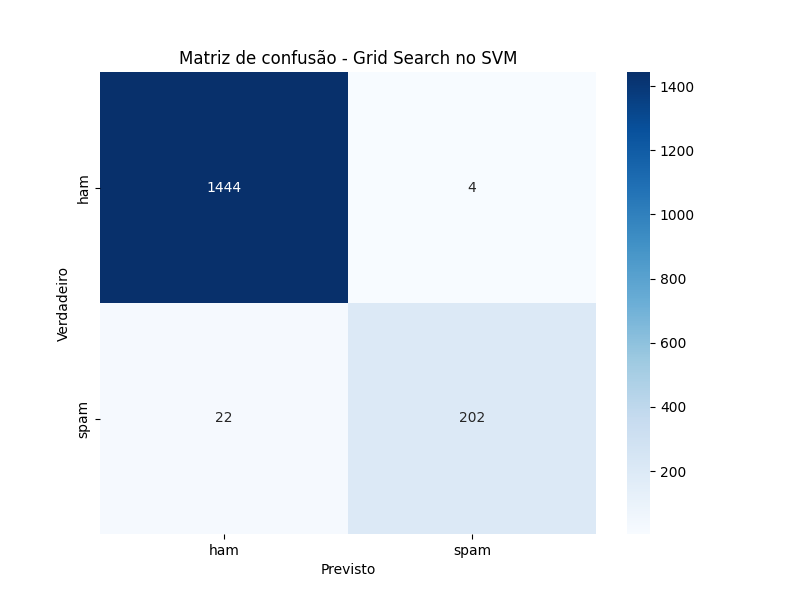

# Conclusão

Os modelos se comportaram de maneira bem semelhantes, cada um com sua particularidade.

### Resumo
- O SVC teve uma acurárcia mais alta, conseguindo um melhor desempenho em identificar os Spams, porém, se confundiu ao marcar 4 hams como spam.
- O Bayes teve um desempenho mais baixo em spam, mas sua assertividade no ham foi de 100%.
- O modelo 'otimizado' do SVC teve uma assertividade mais baixa, deixando passar 1 spam e marcando 1 ham.
- O modelo 'otimizado' do NB (desenvolvido no momento da apresentação) apresentou um melhor comprotamento em relação aos spams porém prejudicou consideravelmente os email's legítimos.  

Analisando esses pontos, por mais que o Bayes tenha deixado passar mais spams, ele garantiu que nenhum e-mail legítimo fosse perdido. Portanto é um modelo mais confiável. 
Também é possível esperar que seja muito difícil desenvolver um modelo que trace uma linha perfeita dividindo os spams de hams (mais métodos precisam ser testados).

Abaixo estão as matrizes de confusão organizadas em ordem 2 para melhor visualização:

 

## Grid Search representa o modelo "otimizado".

